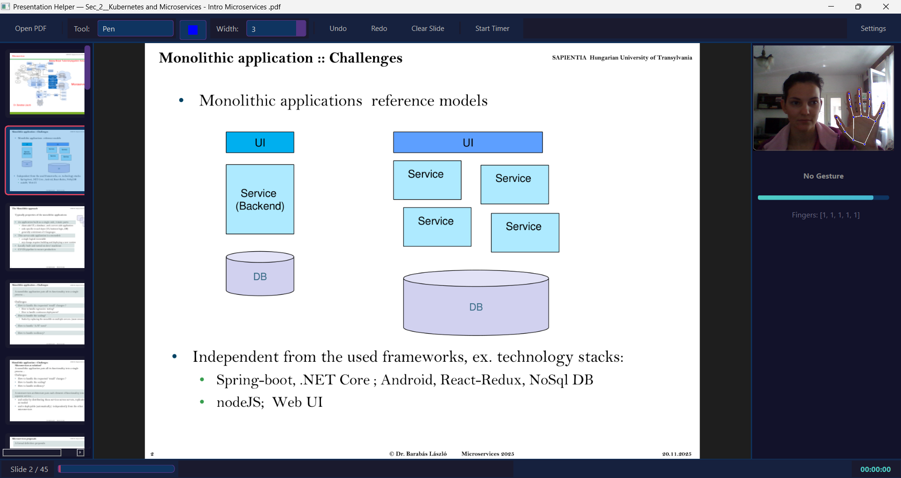
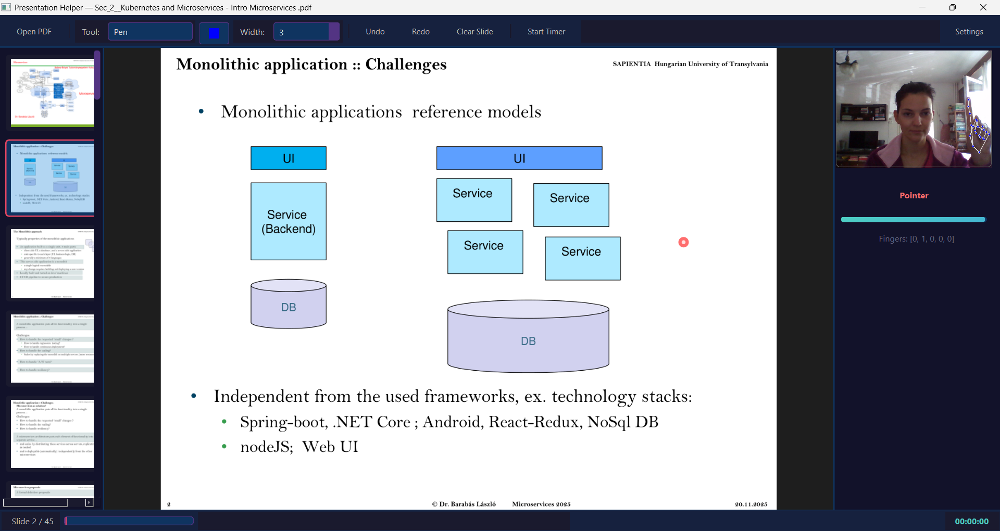
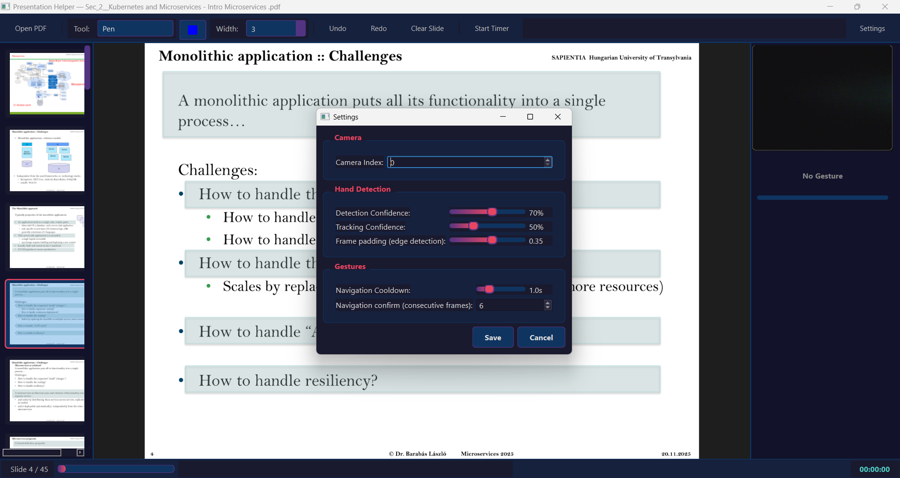

# Presentation Helper

Hand-gesture–controlled PDF presentation assistant powered by webcam
hand tracking.

---

## Contents

1. [Problem statement](#problem-statement)
2. [What the app does](#what-the-app-does)
3. [Gesture cheat sheet](#gesture-cheat-sheet)
4. [Installation](#installation)
5. [Running the app](#running-the-app)
6. [Configuration](#configuration)
7. [Testing](#testing)
8. [Known limitations](#known-limitations)
9. [Further documentation](#further-documentation)

---

## Problem statement

During a talk, a presenter is usually standing next to the screen or
the projector while the input device (mouse, keyboard, remote, stylus)
stays tethered to the laptop. This creates two intertwined practical
issues:

1. **Split attention.** Changing a slide, underlining a sentence or
   circling a figure forces the speaker to walk back to the laptop, or
   to carry an extra physical accessory (a clicker, a laser pointer,
   a digital pen). Both options break the rhythm of the talk and the
   eye contact with the audience.
2. **Hardware lock-in.** Existing hands-free options (wireless
   presentation clickers, interactive whiteboards, styluses, VR/AR
   add-ons) either require dedicated hardware or only work in tightly
   controlled environments. For an average lecture-hall setup
   (laptop + webcam) there is no uniform answer.

*Presentation Helper* targets exactly this gap with a cheap,
hardware-independent solution: it recognises a small, closed,
six-element gesture vocabulary **in real time** from the camera feed
and turns it into presentation actions — slide navigation, pointing,
freehand drawing, undo. All the user needs is a webcam and their own
hand; they can stand meters away from the computer.

The full pipeline description and the coordinate conventions are
documented in [`docs/architecture.md`](docs/architecture.md).

---

## What the app does

The main window is split into three vertical panes: a slide-thumbnail
sidebar on the left, the current slide in the middle, and the live
camera preview (with the detected hand skeleton and the current
recognised gesture) on the right. The toolbar on top exposes PDF
loading, the drawing tool, the colour and width picker, undo/redo,
the presentation timer and the settings dialog.



Feature summary:

- Open and navigate a PDF presentation (mouse, keyboard, **and hand
  gestures**).
- Point at the current slide with your index finger (live red dot).
- Freehand drawing with a two-finger gesture (pen or highlighter,
  configurable colour and width).
- Undo (Ctrl+Z), redo (Ctrl+Y), clear current slide.
- **Closed fist** also undoes the last stroke (half-second hold).
- Slide-thumbnail sidebar.
- Presentation timer (start / pause / resume), full-screen mode (F11).
- Settings dialog: camera index, detection and tracking confidence,
  navigation cooldown, confirmation frame count, frame padding.

---

## Gesture cheat sheet

Recognition is based on **static** hand poses: every frame, the
system computes a finger-extension vector
`[thumb, index, middle, ring, pinky]`, where each component is either
0 (curled) or 1 (extended). Both hands (left and right) are handled
identically, because the camera frame is horizontally mirrored before
processing.

The vocabulary has five active poses; everything else maps to "no
action". The subsections below show each pose with its finger vector,
the action it triggers, and the validation rule used to debounce it.

### Thumb only — previous slide

Finger vector: `[1, 0, 0, 0, 0]`. Validation: 6 consecutive frames
plus a ≥ 1.0 s cooldown between navigations. Hold the pose for roughly
half a second so a transient hand position doesn't cause an unwanted
slide jump.


### Pinky only — next slide

Finger vector: `[0, 0, 0, 0, 1]`. Validation: 6 consecutive frames
plus a ≥ 1.0 s cooldown — same delay characteristic as the thumb
gesture.


### Index only — pointer

Finger vector: `[0, 1, 0, 0, 0]`. Validation: applied every frame
with EMA smoothing — no delay, no cooldown. A red pointer dot tracks
the index fingertip on the slide as long as the pose is held.



### Index + middle — freehand drawing

Finger vector: `[0, 1, 1, 0, 0]`. Validation: every frame; up to 8
lost frames (~267 ms at 30 FPS) are tolerated before the stroke is
committed, so brief tracking dropouts don't break the line. Stroke
colour, width and tool (pen / highlighter) come from the toolbar.


### Closed fist — undo last stroke

Finger vector: `[0, 0, 0, 0, 0]`. Validation: must be held
continuously for ≥ 0.5 s. Once triggered, the most recent stroke is
removed from the current slide (the same as `Ctrl + Z` / the toolbar
undo button).


### Practical tips

- Face the camera with your palm roughly toward the lens. Your hand
  doesn't need to be centred — the pipeline applies extra padding so
  that hands at the edges of the frame are still detected.
- Drawing does **not** require a continuous hand presence — if the
  hand briefly drops out of frame (e.g. during a quick gesture), you
  can keep drawing the same stroke once tracking returns.
- If a slide flips unexpectedly, check the camera preview: usually
  you will see a finger "flickering" between extended and curled. You
  can then tune `min_detection_confidence` and `nav_confirm_frames` —
  see [Configuration](#configuration).

### Keyboard shortcuts

Classic keyboard shortcuts are also available:

| Key | Action |
| --- | --- |
| `→` / `Space` | Next slide |
| `←` | Previous slide |
| `Ctrl + O` | Open PDF |
| `Ctrl + Z` / `Ctrl + Y` | Undo / redo |
| `F11` | Toggle full screen |
| `Esc` | Exit full screen |

---

## Installation

### Prerequisites

- **Python 3.10+** (the code uses `dict | None`-style annotations and
  `from __future__ import annotations`; tested on 3.10 and above).
- **A webcam** (or any UVC-compatible video device).
- Operating system: Windows 10/11, macOS, or Linux. Development was
  done on Windows, but every dependency is cross-platform.
- At least **2 GB of free RAM** and a reasonably modern (4-core) CPU,
  since the MediaPipe Hand Landmarker runs on every frame.

### Clone and create a virtual environment

```bash
git clone <repo-url> handtrackingPresentation
cd handtrackingPresentation
python -m venv .venv
```

Activate the virtual environment:

- **Windows (PowerShell):** `.\.venv\Scripts\Activate.ps1`
- **Windows (cmd):** `.\.venv\Scripts\activate.bat`
- **macOS / Linux:** `source .venv/bin/activate`

### Install dependencies

For runtime only:

```bash
pip install -r requirements.txt
```

For development (runtime + tests):

```bash
pip install -r requirements-dev.txt
```

`requirements.txt` pulls in the following packages:
`PySide6`, `mediapipe`, `opencv-python`, `pymupdf`, `numpy`, `Pillow`.

### The hand-tracking model

The MediaPipe `hand_landmarker.task` file is expected at
`resources/hand_landmarker.task`. The repository ships with the model
as a version-controlled binary, so **no separate download is needed**.
If it ever goes missing, you can grab the official model from the
[MediaPipe Hand Landmarker page](https://ai.google.dev/edge/mediapipe/solutions/vision/hand_landmarker)
and place it into `resources/` under that same file name.

---

## Running the app

Once the virtual environment is active:

```bash
python main.py
```

The main window opens maximised. There is no PDF loaded on first
launch: click the **"Open PDF"** button in the toolbar (or hit
`Ctrl + O`) and pick the document you want to present. From that
point on you can drive the presentation with the gestures described
in the [Gesture cheat sheet](#gesture-cheat-sheet).

---

## Configuration

Runtime parameters can be edited live through the **Settings** dialog
(toolbar, far right). Saved values take effect immediately (the hand
tracker and the gesture engine are reinitialised). The dialog groups
its controls into three sections — camera, hand detection, and
gestures — matching the parameters listed in `DEFAULT_SETTINGS`.



At startup the app boots with the `DEFAULT_SETTINGS` values from
`config.py`:

| Parameter | Default | Controls |
| --- | --- | --- |
| `camera_index` | `0` | OpenCV camera index (if you have more than one) |
| `min_detection_confidence` | `0.7` | When a hand is considered detected |
| `min_tracking_confidence` | `0.5` | When tracking is considered preserved |
| `nav_cooldown` | `1.0` s | Minimum time between two slide changes |
| `nav_confirm_frames` | `6` | Frames required to confirm a navigation gesture |
| `fist_hold_time` | `0.5` s | How long the fist must be held to trigger undo |
| `frame_padding_ratio` | `0.35` | Padding around the camera frame (edge-hand detection) |

---

## Testing

Run the full test suite:

```bash
pytest
```

`pytest.ini` configures the test paths, the `pythonpath`, and strict
markers. The suite covers the `core/` modules (annotation manager,
gesture-engine logic, coordinate remapping); the Qt layer is not
covered with end-to-end tests.

---

## Known limitations

The current version's deliberate trade-offs and open issues:

- **Single hand only.** The `HandTracker` runs with `max_hands=1`.
  Two-handed gestures are not supported; if both
  hands are visible, MediaPipe picks which one to track.
- **Static poses only.** Recognition relies purely on the
  finger-extension vector; there is **no temporal (dynamic) gesture
  recognition**. So, for instance, a "swipe-left" motion is not
  picked up — you have to show the thumb pose instead.
- **Closed set of six classes.** The `GestureType` set is fixed
  (thumb, pinky, index, two-finger, fist, none). Adding new gestures
  requires editing `core/hand_tracker.py` and `core/gesture_engine.py`.
- **Lighting sensitivity.** Under poor lighting, MediaPipe's
  detection confidence drops; in that regime the classifier tends to
  "flicker" between *pointer* and *draw*. Turn on a light, or raise
  the detection confidence threshold.
- **Busy, patterned backgrounds.** Hand-like textures (wood grain,
  striped sleeves) can cause false detections. Aim for a plain
  background.
- **PDF input only.** `core/pdf_renderer.py` is built on top of
  PyMuPDF; loading PPTX / HTML / image-based decks is not supported.
  Workaround: export your slides to PDF.
- **Annotations are not persistent.** Strokes and notes you draw
  exist **only for the current run**; closing the app discards them.
  Saving and reloading (`JSON` format) is on the backlog but not yet
  exposed in the UI.
- **The presentation timer isn't persistent.** Similarly, the running
  timer is reset when the app closes.
- **Webcam permission.** On macOS the OS will explicitly prompt for
  camera access on first launch; if you decline, the app will show a
  black camera feed. You can also switch cameras through the
  *Settings* dialog (e.g. after plugging in an external camera) by
  changing `camera_index`.
- **Performance.** On a slow machine the 30 FPS loop can dip, which
  becomes visible as pointer latency. Lowering `frame_padding_ratio`
  (Settings dialog) speeds up detection at the cost of less reliable
  edge-of-frame tracking.

---

## Further documentation

- [`docs/architecture.md`](docs/architecture.md) — detailed
  walkthrough of the frame pipeline, the normalised coordinate
  conventions, the debouncing rules and the gesture vocabulary. Also
  describes the data flow between `MainWindow._process_frame`,
  `HandTracker`, and `GestureEngine`.
- `config.py` — default values and the app version.
- `pytest.ini` — test runner configuration.
