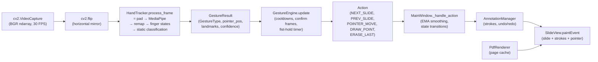

# Architecture

This document specifies three things: the per-frame processing pipeline, the
normalised coordinate convention used to store all geometric data, and the
closed gesture vocabulary recognised by the application.

## 1. Per-frame pipeline

The application runs at a fixed cadence of `FRAME_RATE_MS = 33` ms (~30 FPS),
driven by a `QTimer` started in `MainWindow._setup_timers`. On every tick,
`MainWindow._process_frame` performs the following sequence:

1. **Frame capture** — `cv2.VideoCapture.read()` returns a BGR `np.ndarray`
   of shape `(H, W, 3)`. If the camera is unavailable the frame is skipped.
2. **Horizontal mirror** — `cv2.flip(frame, 1)`. The user sees their hand as
   in a mirror, which is the expected mental model for direct manipulation.
3. **Hand tracking** — `HandTracker.process_frame(frame)`:
   - Convert BGR → RGB.
   - Apply asymmetric padding (`_pad_frame`): `pad_y = H · 0.35`,
     `pad_x = W · 0.35 · 1.4`. The extra horizontal padding mitigates a known
     MediaPipe failure mode where hands at the left/right edge are lost.
   - Run `HandLandmarker.detect_for_video()` (VIDEO mode, monotonic timestamp
     advanced by 33 ms per frame).
   - Re-map landmarks from the padded image back into the original image
     normalised space (`_remap_landmarks`, see §2).
   - Compute the 5-bit finger-state vector (`_get_finger_states`).
   - Classify into a `GestureType` (`_detect_static_gesture`).
   - Return a `GestureResult` (gesture, pointer position when applicable,
     handedness confidence, raw landmarks, finger states).
4. **Gesture debouncing** — `GestureEngine.update(gesture_result)` applies
   timing rules (consecutive-frame confirmation for navigation, hold time
   for fist) and returns either an `Action` or `None`.
5. **Action dispatch** — `MainWindow._handle_action(action)` applies EMA
   smoothing to pointer/draw positions and routes the action: `DRAW_POINT`
   feeds `AnnotationManager`, `NEXT_SLIDE` / `PREV_SLIDE` advance the deck,
   `ERASE_LAST` undoes one stroke.
6. **Idle handling (no action this frame)** — to keep the UX smooth in the
   presence of brief tracking dropouts:
   - If currently drawing, allow up to 8 lost frames (~267 ms) before
     committing the stroke.
   - Otherwise, keep the pointer dot visible for up to 4 lost frames
     (~133 ms) before clearing it.
7. **Repaint** — `SlideView.update()` schedules a `paintEvent`, which in
   order draws: dark background → slide bitmap → completed strokes →
   active stroke → pointer/draw-preview dot.

### 1.1 Component data flow



## 2. Normalised coordinate convention

The pipeline uses three coordinate spaces. Strokes and pointer positions are
**always stored in normalised original-frame space**, which makes annotations
resolution-independent and trivially serialisable.

| # | Space | Range | Origin | Used by |
| --- | --- | --- | --- | --- |
| 1 | Padded-image normalised | `[0, 1]²` over the padded RGB image | top-left | MediaPipe output (`landmark.x/y`) |
| 2 | Original-frame normalised | `[0, 1]²` over the (un-padded, mirrored) camera frame | top-left | `GestureResult.pointer_pos`, `Stroke.points`, JSON persistence |
| 3 | Slide-widget pixel | integer pixels inside `slide_rect` | top-left of `slide_rect` | `SlideView._draw_stroke`, `SlideView._draw_pointer` |

All three spaces share the same orientation: `+x` to the right, `+y` downward.
This matches Qt, OpenCV, and MediaPipe; no axis flips are required outside of
the explicit horizontal mirror in step 2 of the pipeline.

With `padding_ratio = r = 0.35` and the asymmetric horizontal factor `1.4`,
let `r_x = r · 1.4 = 0.49` and `r_y = r = 0.35`. A landmark `(u, v)` in
space 1 is mapped into space 2 by `HandTracker._remap_landmarks` as:

```
x = clamp(u · (1 + 2·r_x) − r_x, 0, 1)  =  clamp(u · 1.98 − 0.49, 0, 1)
y = clamp(v · (1 + 2·r_y) − r_y, 0, 1)  =  clamp(v · 1.70 − 0.35, 0, 1)
```

The clamp is intentional: a landmark detected inside the padding (rarely a
true fingertip) is snapped to the nearest edge of the original frame.

Rendering into space 3 happens only at paint time. `SlideView` computes a
centred, aspect-ratio-preserving `QRect` for the current page, and a
normalised point `(x, y)` from space 2 is drawn at:

```
px = slide_rect.x() + round(x · slide_rect.width())
py = slide_rect.y() + round(y · slide_rect.height())
```

Because all stored data lives in space 2, window resizing and zoom changes
update strokes seamlessly without rewriting any persisted coordinate.

## 3. Gesture vocabulary

The vocabulary is a closed set of six raw gestures. Each gesture is defined
purely by a 5-bit finger-extension vector `[thumb, index, middle, ring,
pinky]`, computed from landmark geometry; no temporal information is used at
this stage. Temporal validation (debouncing, hold timing) is performed by
`GestureEngine` on top of these raw labels.

| Pose | Finger vector | `GestureType` | `ActionType` | Validation rule |
| --- | --- | --- | --- | --- |
| Thumb only | `[1, 0, 0, 0, 0]` | `THUMB_PREV` | `PREV_SLIDE` | 6 consecutive frames + ≥ 1.0 s since last navigation |
| Pinky only | `[0, 0, 0, 0, 1]` | `PINKY_NEXT` | `NEXT_SLIDE` | 6 consecutive frames + ≥ 1.0 s since last navigation |
| Index only | `[0, 1, 0, 0, 0]` | `POINTER` | `POINTER_MOVE` | none (every frame, with EMA smoothing) |
| Index + middle | `[0, 1, 1, 0, 0]` | `DRAW` | `DRAW_POINT` | none; up to 8 lost frames are tolerated before the stroke is committed |
| Closed fist | `[0, 0, 0, 0, 0]` | `FIST` | `ERASE_LAST` | held continuously for ≥ 0.5 s |
| Anything else | other vectors | `NONE` | — | — |

Pointer position for both `POINTER` and `DRAW` is taken from the index
fingertip, landmark `8` in MediaPipe’s indexing. No two distinct gestures
share the same finger vector, so the static classifier is a simple lookup
with no precedence rules.
