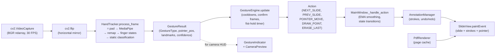
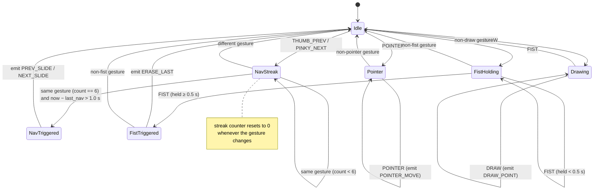

# Architecture

This document describes the runtime architecture of *Presentation Helper*: the
per-frame processing pipeline, the coordinate conventions used at each stage,
and the gesture vocabulary that the application recognises. It is intended both
as an onboarding reference for contributors and as a stable specification of
the design choices made during development.

## 1. Module layout

| Path | Responsibility |
| --- | --- |
| `main.py` | Application entry point; loads QSS, instantiates `MainWindow`. |
| `config.py` | Default settings (`DEFAULT_SETTINGS`), model path, frame interval. |
| `core/hand_tracker.py` | MediaPipe HandLandmarker wrapper, finger-state extraction, static gesture classification. |
| `core/gesture_engine.py` | Debouncing and timing rules; converts raw gestures into validated `Action`s. |
| `core/annotation_manager.py` | Per-slide stroke storage, undo/redo, JSON persistence. |
| `core/pdf_renderer.py` | PDF page rendering and caching. |
| `ui/main_window.py` | Top-level window; owns the per-frame loop and orchestrates all other components. |
| `ui/slide_view.py` | Slide rendering, stroke drawing, pointer/draw-preview. |
| `ui/toolbar.py`, `ui/settings_dialog.py`, `ui/camera_preview.py`, `ui/gesture_indicator.py` | Auxiliary UI widgets. |
| `resources/hand_landmarker.task` | MediaPipe Tasks model file. |
| `resources/styles.qss` | Application theme. |

The clean separation between `core/` (no Qt imports) and `ui/` (Qt widgets) is
deliberate: the gesture pipeline can be unit-tested or replaced without
touching the rendering layer.

## 2. Per-frame pipeline

The application runs at a fixed cadence of `FRAME_RATE_MS = 33` ms (~30 FPS),
driven by a `QTimer` started in `MainWindow._setup_timers`. On every tick,
`MainWindow._process_frame` performs the following sequence:

1. **Frame capture** — `cv2.VideoCapture.read()` returns a BGR `np.ndarray`
   of shape `(H, W, 3)`. If the camera is unavailable the frame is skipped.
2. **Horizontal mirror** — `cv2.flip(frame, 1)`. The user sees their hand as
   in a mirror, which is the expected mental model for direct manipulation.
3. **Hand tracking** — `HandTracker.process_frame(frame)`:
   - Convert BGR → RGB.
   - Apply asymmetric padding (`_pad_frame`): `pad_y = H · 0.35`,
     `pad_x = W · 0.35 · 1.4`. The extra horizontal padding mitigates a known
     MediaPipe failure mode where hands at the left/right edge are lost.
   - Run `HandLandmarker.detect_for_video()` (VIDEO mode, monotonic timestamp
     advanced by 33 ms per frame).
   - Re-map landmarks from the padded image back into the original image
     normalised space (`_remap_landmarks`, see §3).
   - Compute the 5-bit finger-state vector (`_get_finger_states`).
   - Classify into a `GestureType` (`_detect_static_gesture`).
   - Return a `GestureResult` (gesture, pointer position when applicable,
     handedness confidence, raw landmarks, finger states).
4. **UI feedback** — update the `GestureIndicator` (label + confidence bar),
   the finger-state debug label, and render the camera preview with hand
   skeleton overlay (`HandTracker.draw_landmarks_on_frame`).
5. **Gesture debouncing** — `GestureEngine.update(gesture_result)` applies
   the timing rules described in §5 and returns either an `Action` or `None`.
6. **Action dispatch** — `MainWindow._handle_action(action)`:
   - If transitioning *away* from `DRAW_POINT`, finalise the active stroke
     (`AnnotationManager.finish_stroke`).
   - Apply EMA smoothing to pointer/draw positions
     (`new = α · prev + (1-α) · raw`, with `α = 0.4`; see §6).
   - For `DRAW_POINT`, push the smoothed point into the
     `AnnotationManager`, set the live preview pointer with the current
     tool (`pen` / `highlighter`), and trigger a repaint.
   - For `NEXT_SLIDE` / `PREV_SLIDE`, advance the deck.
   - For `ERASE_LAST`, undo one stroke.
7. **Idle handling (no action this frame)** — to keep the UX smooth in the
   presence of brief tracking dropouts:
   - If currently drawing, allow up to 8 lost frames (~267 ms) before
     committing the stroke.
   - Otherwise, keep the pointer dot visible for up to 4 lost frames
     (~133 ms) before clearing it.
8. **Repaint** — `SlideView.update()` schedules a `paintEvent`, which in
   order draws: dark background → slide bitmap → completed strokes →
   active stroke → pointer/draw-preview dot.

### 2.1 Component data flow



### 2.2 GestureEngine state machine

`GestureEngine` is the only component with non-trivial temporal state. It
guards three concerns simultaneously: (a) navigation requires a sustained
gesture, (b) a single navigation must not retrigger immediately, (c) the fist
gesture must be held briefly to avoid accidental erasure.



The state machine is implemented imperatively in `GestureEngine.update`; the
diagram is the conceptual model that the code realises.

## 3. Coordinate conventions

The pipeline uses three coordinate spaces. Strokes and pointer positions are
**always stored in normalised original-frame space**, which makes annotations
resolution-independent and trivially serialisable.

| # | Space | Range | Origin | Used by |
| --- | --- | --- | --- | --- |
| 1 | Padded-image normalised | `[0, 1]² ` over the padded RGB image | top-left | MediaPipe output (`landmark.x/y`) |
| 2 | Original-frame normalised | `[0, 1]²` over the (un-padded, mirrored) camera frame | top-left | `GestureResult.pointer_pos`, `Stroke.points`, JSON persistence |
| 3 | Slide-widget pixel | integer pixels inside `slide_rect` | top-left of `slide_rect` | `SlideView._draw_stroke`, `SlideView._draw_pointer` |

All three spaces share the same orientation: `+x` to the right, `+y` downward.
This matches Qt, OpenCV, and MediaPipe; no axis flips are required outside of
the explicit horizontal mirror in step 2 of the pipeline.

### 3.1 Space 1 → Space 2: padding compensation

With `padding_ratio = r = 0.35` (default) and the asymmetric horizontal
factor `1.4`, the padded image is `(1 + 2·r·1.4) × (1 + 2·r)` times the
original. Let `r_x = r · 1.4 = 0.49` and `r_y = r = 0.35`. Then for a
landmark `(u, v)` produced by MediaPipe in space 1:

```
x = clamp(u · (1 + 2·r_x) − r_x, 0, 1)
  = clamp(u · 1.98 − 0.49, 0, 1)

y = clamp(v · (1 + 2·r_y) − r_y, 0, 1)
  = clamp(v · 1.70 − 0.35, 0, 1)
```

The clamp is intentional: a landmark detected inside the padding (which is
black pixels and rarely a true fingertip) is snapped to the nearest edge of
the original frame. This is implemented in `HandTracker._remap_landmarks`.

### 3.2 Mirroring

The horizontal flip is applied **once**, on the BGR frame (`cv2.flip(frame,
1)`), before MediaPipe sees it. From that point onwards every subsequent
stage — including the finger-state extractor and the slide renderer —
operates in mirrored space. As a consequence, `HandTracker._get_finger_states`
detects the thumb by `landmarks[4].x < landmarks[3].x`, which is the correct
inequality for the user’s **right hand** as seen in a mirror. Left-handed
operation would require flipping this comparison or the input frame.

### 3.3 Space 2 → Space 3: rendering

`SlideView._get_slide_rect` computes a centred, aspect-ratio-preserving
`QRect` for the current page, taking the user’s zoom (`1.0`–`3.0`) into
account:

```
base_scale      = min(widget_w / img_w, widget_h / img_h)
effective_scale = base_scale · zoom_scale
slide_rect      = centre(widget) − (scaled_w/2, scaled_h/2), scaled_w × scaled_h
```

A normalised point `(x, y)` from space 2 is then rendered at:

```
px = slide_rect.x() + round(x · slide_rect.width())
py = slide_rect.y() + round(y · slide_rect.height())
```

This conversion is the only place where pixel coordinates appear; it is
recomputed on every `paintEvent` so window resizing and zoom changes update
strokes seamlessly without rewriting any stored data.

## 4. Gesture vocabulary

The vocabulary is a closed set of six raw gestures. Each gesture is defined
purely by a 5-bit finger-extension vector `[thumb, index, middle, ring,
pinky]`, computed from landmark geometry; no temporal information is used at
this stage. Temporal validation (debouncing, hold timing) is performed by
`GestureEngine` on top of these raw labels.

| Pose | Finger vector | `GestureType` | `ActionType` | Validation rule |
| --- | --- | --- | --- | --- |
| Thumb only | `[1, 0, 0, 0, 0]` | `THUMB_PREV` | `PREV_SLIDE` | 6 consecutive frames + ≥ 1.0 s since last navigation |
| Pinky only | `[0, 0, 0, 0, 1]` | `PINKY_NEXT` | `NEXT_SLIDE` | 6 consecutive frames + ≥ 1.0 s since last navigation |
| Index only | `[0, 1, 0, 0, 0]` | `POINTER` | `POINTER_MOVE` | none (every frame, with EMA smoothing) |
| Index + middle | `[0, 1, 1, 0, 0]` | `DRAW` | `DRAW_POINT` | none; up to 8 lost frames are tolerated before the stroke is committed |
| Closed fist | `[0, 0, 0, 0, 0]` | `FIST` | `ERASE_LAST` | held continuously for ≥ 0.5 s |
| Anything else | other vectors | `NONE` | — | — |

Pointer position for both `POINTER` and `DRAW` is taken from the index
fingertip, landmark `8` in MediaPipe’s indexing.

### 4.1 Design rationale

- **Disjoint poses.** No two distinct gestures share the same finger vector,
  so the static classifier is a simple lookup with no precedence rules.
- **Symmetry of navigation.** Thumb (left-most digit) maps to *previous*,
  pinky (right-most digit) maps to *next*. This matches the spatial layout
  of the hand and is intuitive for both left- and right-handed users.
- **Distinct ergonomics for distinct intents.** Drawing is a two-finger pose
  (index + middle), whereas pointing is single-finger; this avoids the
  most common confusion mode in single-handed gesture systems.
- **Closed-fist for erase.** Choosing the fist (a maximally distinct pose
  from all four navigation/pointing/drawing gestures) and gating it behind
  a hold time minimises accidental erasure during transient
  misclassifications.
- **No `NONE` action.** Frames whose pose does not match any vocabulary
  entry produce no action and reset all transient counters in
  `GestureEngine`. This is essential for the consecutive-frame validation
  to behave intuitively.

## 5. Timing parameters

All timing constants are concentrated in two places: `config.py`
(`DEFAULT_SETTINGS`, configurable through the Settings dialog) and the
`GestureEngine.__init__` defaults. The current values are:

| Parameter | Value | Where | Purpose |
| --- | --- | --- | --- |
| `FRAME_RATE_MS` | `33` | `config.py` | Frame loop period (~30 FPS). |
| `min_detection_confidence` | `0.7` | `DEFAULT_SETTINGS` | MediaPipe detection threshold. |
| `min_tracking_confidence` | `0.5` | `DEFAULT_SETTINGS` | MediaPipe tracking threshold. |
| `frame_padding_ratio` | `0.35` | `DEFAULT_SETTINGS` | Vertical padding ratio; horizontal is `0.35 × 1.4`. |
| `nav_cooldown` | `1.0 s` | `DEFAULT_SETTINGS` | Minimum gap between successive slide navigations. |
| `nav_confirm_frames` | `6` | `DEFAULT_SETTINGS` | Consecutive frames required to confirm a navigation gesture. |
| `fist_hold_time` | `0.5 s` | `DEFAULT_SETTINGS` | Hold duration to trigger erase. |
| Pointer EMA `α` | `0.4` | `MainWindow._pointer_smooth_alpha` | Weight on the previous smoothed position. Larger `α` = smoother, more lag. |
| Draw lost-frame grace | `8` frames | `MainWindow._process_frame` | Tracking dropouts tolerated before finalising a stroke. |
| Pointer lost-frame grace | `4` frames | `MainWindow._process_frame` | Frames the pointer dot persists after the gesture is lost. |

## 6. Pointer smoothing

`MainWindow._handle_action` applies a one-tap exponential moving average to
both `POINTER_MOVE` and `DRAW_POINT` positions:

```
smoothed_x = α · previous_smoothed_x + (1 − α) · raw_x
smoothed_y = α · previous_smoothed_y + (1 − α) · raw_y
```

with `α = 0.4`. The smoothed position is what is fed into both the pointer
overlay and `AnnotationManager.add_point`, so persisted strokes are already
filtered. A second pass — a moving-average window of size 3 — is applied in
`AnnotationManager.finish_stroke` via `Stroke.smooth`, which removes the
remaining high-frequency jitter once the user lifts the gesture.

## 7. Persistence model

`AnnotationManager` exposes `save(path)` / `load(path)` that serialise the
per-slide stroke dictionary to JSON. Each `Stroke` records its `points` (in
space 2), `color` (`#RRGGBB`), `width`, and `tool` (`"pen"` or
`"highlighter"`). Because all geometric data is normalised, a JSON file can
be opened against the same PDF on a different machine, monitor, or window
size without any transformation.
